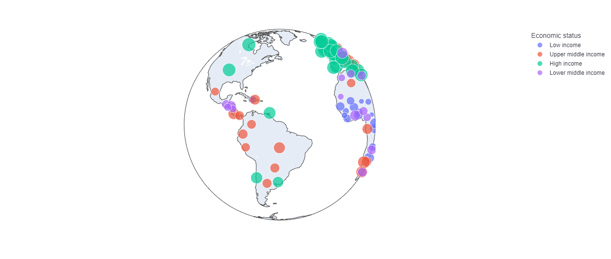

# La digitalización de las finanzas: una oportunidad para reducir la pobreza

## Análisis exploratorio de datos
----------------------------------------------------------------------------------------------

Global Findex: Base de datos sobre la inclusión financiera en el mundo

[Global Financial Inclusion · Streamlit](https://share.streamlit.io/gonzalovf1996/global_financial_inclusion/main/main.py)

## Abstracto
----------------------------------------------------------------------------------------------
_El presente trabajo analiza los datos aportados por Global Findex sobre los niveles de desbancarización en el mundo, con un énfasis especial en los parámetros comunes de aquellos países donde está creciendo la inclusión financiera. Un análisis inicial de los resultados en los distintos años (2011, 2014, 2017) indica una clara tendencia a la expansión de servicios financieros formales de forma sistemática en todas las regiones geográficas estudiadas. Una observación más precisa encuentra pruebas a favor de la hipótesis de que la digitalización ha supuesto un avance firme hacia una mayor accesibilidad de herramientas financieras en zonas remotas. No obstante, para lograr una expansión de servicios financieros a las poblaciones más vulnerables, es indispensable compaginar estos esfuerzos con educación financiera, de tal modo que les garantice el acceso a herramientas financieras que brinden las dosis correctas de disciplina, seguridad, flexibilidad e incentivos._

## Analisis
----------------------------------------------------------------------------------------------

Publicado en Streamlit App 👉 [Global Financial Inclusion · Streamlit](https://share.streamlit.io/gonzalovf1996/global_financial_inclusion/main/main.py)

## Referencias del estudio
----------------------------------------------------------------------------------------------

### Global Findex

La base de datos __Global Findex__ supone la recogida de información más completa a nivel mundial sobre cómo los mayores de 15 años ahorran, solicitan préstamos, realizan pagos, gestionan el riesgo y cómo atienden financieramente ante emergencias.

Tras este recurso hay un trabajo muy elaborado en el que han participado más de 150,000 personas mayores de 15 años , representando una muestra significativa a nivel nacional en más de 148 países. Los datos han sido recogidos en el 2011, 2014 y 2017, y están centrados en lograr una comprension mayor sobre las situaciones de vulnerabilidad financiera en el mundo, de tal modo que sirva tanto a gobiernos como a la iniciativa privada como marco para la acción.

El informe del año 2017 incluye como novedad cuestiones sobre tecnología digital, teléfonos móviles e internet, aspectos esenciales en la inclusión financiera.

La base de datos está disponible en _Demirgüç-Kunt, Asli, Leora Klapper, Dorothe Singer, Saniya Ansar, and Jake Hess. 2018. The Global Findex Database 2017: Measuring Financial Inclusion and the Fintech Revolution. Washington, D.C_. Extraídos del [Banco Mundial](https://globalfindex.worldbank.org/index.php/#data_sec_focus).

### Otros datos utilizados:

Se han consultado las siguientes bases de datos:

__Acceso a electricidad en el mundo__. Incluye datos de 1990 a 2019. Unidad de medida: porcentaje de población por país (incluye 170 países). Extraídos del [Banco Mundial](https://data.worldbank.org/indicator/EG.ELC.ACCS.ZS).

__Acceso a la educación en el mundo__. Se incluyen dos datasets, distinguiendo el acceso a la educación por parte de hombres adultos y de mujeres adultas. Datos del Banco Mundial, facilitados por un usuario de [GitHub](https://github.com/cllocc/DAND_project_2). Los datos sin tratar están accesibles en el [Banco Mundial](https://databank.worldbank.org/EdStats_Indicators_Report/id/c755d342#).

__Ratio de alfabetismo en el mundo__. Incluye datos de mayores de 15 años, en porcentaje de población por país. Son datos proporcionados por [UNICEF](https://data.unicef.org/topic/education/learning-and-skills/) con fecha de abril del año 2021.

__Acceso global a internet__. Son datos del año 2017, expresados en porcentaje de población por país. Son datos proporcionados por la ONU, y tratados por el [Banco Mundial](https://data.worldbank.org/indicator/IT.NET.USER.ZS).

__Acceso a teléfonos móviles__. Son datos del año 2018, expresados en porcentaje de población por país. Extraído del [Banco Mundial]( https://data.worldbank.org/indicator/IT.CEL.SETS.P2).

__Datos de población mundial por país__. Se extraen del [Banco Mundial](https://data.worldbank.org/indicator/SP.POP.TOTL).

__Datos sobre la posición geográfica de los países__: [CSV](https://gist.githubusercontent.com/tadast/8827699/raw/3cd639fa34eec5067080a61c69e3ae25e3076abb/countries_codes_and_coordinates.csv) .
